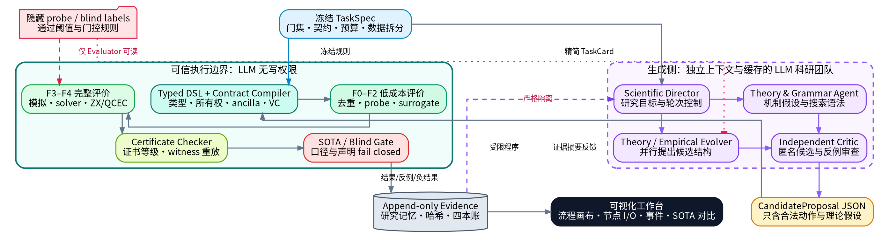
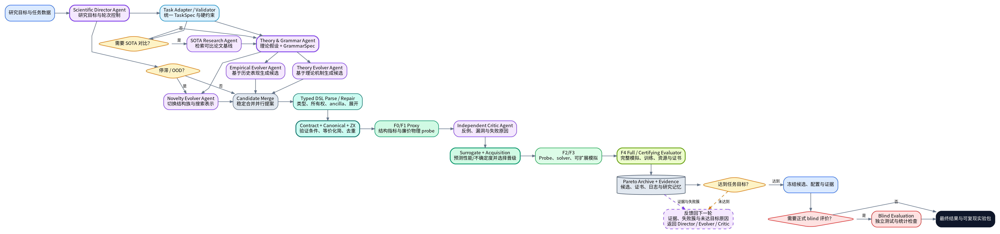
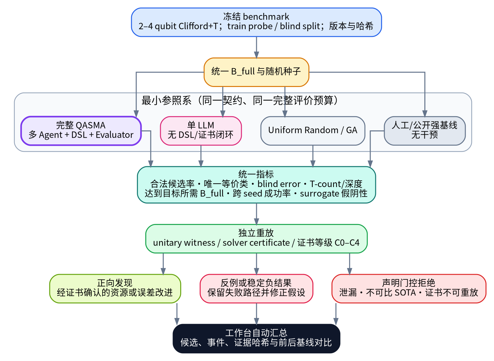
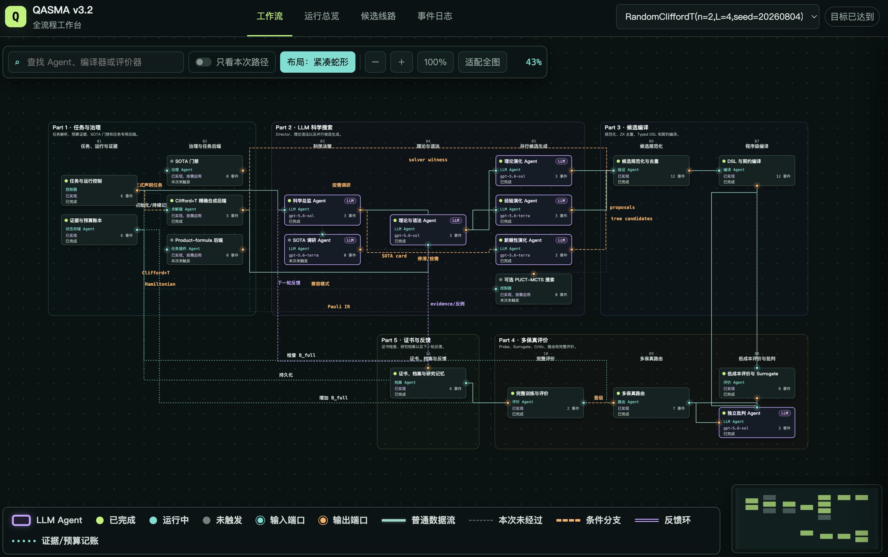

# QASMA

QASMA（Quantum Architecture Search Multi-Agent）是一个面向量子架构搜索的多 Agent 研究框架。它把搜索组织为“任务冻结—理论规划—并行候选生成—确定性编译—多保真评价—证据反馈”的闭环：LLM Agent 负责需要创造力的科学推理，代码化的编译器、求解器和评价器负责裁决可验证事实。

前端工作台演示页面已部署在 [https://qasma.vercel.app](https://qasma.vercel.app)。
[](https://qasma.vercel.app)



## 架构定位

QASMA 由四类核心能力组成：

1. **LLM 科学团队**理解任务、提出可证伪假设、选择搜索语法、创造完整候选并设计反例；
2. **搜索控制器**组织独立 Agent、检索研究档案、控制条件分支并分配高成本评价预算；
3. **开放式 Typed DSL 与契约编译器**把候选变成类型明确、可组合、可展开和可验证的程序；
4. **多保真 Certifying Evaluator**裁决合法性、等价性、近似误差、资源成本和证书等级。

LLM 不直接决定线路是否正确、候选是否等价、误差是否达标、资源计数是否准确或是否超过可比基线。这些结论必须来自确定性验证组件。反过来，随机搜索、遗传算法、树搜索或 solver-only 方法可以作为基线或任务插件，但不能在核心 LLM 角色失败时冒充一次完整的 QASMA 运行。

架构控制流保持固定，SOTA 检索、Novelty、exact solver、active probe、surrogate、blind evaluation、硬件路由等能力根据任务契约选择性启用。

## 多 Agent 科学团队

QASMA 保留少量、相互独立且职责互补的 Agent，避免把同一上下文在大量角色间反复转述。

| Agent | 启用方式 | 主要输入 | 结构化输出 | 职责边界 |
|---|---|---|---|---|
| Scientific Director | 每轮常驻 | TaskSpec、archive 摘要、停滞状态、审计结果 | `ControlDecision` | 设定本轮目标、分配任务、触发可选能力和决定继续或冻结；不裁决数值事实 |
| Theory & Grammar Architect | 每轮常驻 | 任务结构、合法动作、研究记忆、反例 | `TheoryGrammarPlan` | 提出可证伪机制，选择 primitive、block 或 hybrid grammar |
| Theory Evolver | 每轮常驻 | 理论假设、grammar、相关 archive | `CandidateProposal[]` | 根据代数、对称性、交换关系和算法结构生成完整候选 |
| Empirical Evolver | 每轮常驻 | 多样化精英、失败簇、评价 residual | `CandidateProposal[]` | 编辑有效 motif，比较成功与失败差异并修复资源瓶颈 |
| Independent Critic | 每轮常驻 | 匿名候选、契约摘要、低成本指标 | `CritiqueBatch` | 指出理论风险、设计可执行反例测试并建议评价优先级 |
| SOTA Research Agent | 按需 | 已登记来源、任务与指标作用域 | `SOTACard` | 整理可比较基线、条件和复现状态；不参与逐轮候选生成 |
| Novelty Evolver | 停滞/OOD 时 | 较少的 leader 信息、失败边界、grammar | `CandidateProposal[]` | 切换结构族、寄存器划分或搜索表示，而不是添加随机噪声 |

各 Agent 使用独立上下文，只取得与其职责相关的 archive 切片。Critic 不共享候选提出者的长上下文，Novelty Evolver 刻意减少当前精英信息，从而降低角色同质化和确认偏差。



## 单轮搜索流程

一次搜索轮次按以下顺序执行：

1. **任务冻结与适配**：统一 `TaskSpec` 固定目标、寄存器语义、门集、拓扑、资源限制、数据划分、允许能力和评价插件；确定性 Validator 拒绝相互冲突的任务定义。
2. **轮次规划**：Scientific Director 读取当前 Pareto front、失败簇、停滞指标和可用预算，生成有限的 `ControlDecision`。
3. **理论与语法设计**：Theory & Grammar Architect 给出可证伪假设、预期机制、适用范围、反例测试和本轮 `GrammarSpec`。
4. **并行候选生成**：Theory Evolver 与 Empirical Evolver 从不同证据视角生成完整候选；出现停滞或 OOD 信号时加入 Novelty Evolver。
5. **候选合并**：控制器稳定合并各批候选，保留来源和父候选关系，但不接受 Agent 自报的性能结论。
6. **确定性处理**：Schema parse、typed repair、hard constraints、native expansion、canonicalization、等价去重和 verification-condition 生成依次执行。
7. **低成本评价与独立批判**：F0–F2 产生结构特征、probe、surrogate 预测与不确定度；Critic 根据这些事实提出风险和反例测试。
8. **多保真路由**：Router 综合候选价值、不确定度、新颖性、证书潜力、预计评价成本和剩余预算，选择进入 F3/F4 的候选。
9. **完整评价与证书检查**：晋级候选接受完整模拟、solver、等价检查、资源展开或其他适用的严格评价，证书由独立 checker 重放。
10. **归档与反馈**：候选、指标、资源、失败标签、父哈希、证书和 provenance 写入 append-only evidence；摘要反馈给下一轮 Agent。

达到任务门槛时，系统冻结候选、TaskSpec、配置和证据。如果目标包含正式泛化或 SOTA 声明，则在冻结后进入隔离的 blind evaluation；否则直接生成可复现实验包。未达到门槛时，证据、失败簇和未验证假设返回下一轮。

## CandidateProposal 与确定性边界

Evolver 提交的是结构化候选，而不是自由文本线路。一个候选至少表达：

```text
CandidateProposal
├── candidate_id
├── representation: primitive | macro | hybrid | policy
├── program
├── parent_hashes
├── mechanism
├── expected_gain
├── risk
└── requested_checks
```

`mechanism` 和 `expected_gain` 用于组织研究假设，但不会被当作 fidelity 或资源事实。候选必须依次通过：

```text
Schema Parse
  → Typed AST / Deterministic Repair
  → F0 Hard Constraints / Native Expansion
  → Contract Summary / Canonicalization / Dedup
  → Verification Conditions
  → F1 Structural Proxy
  → Independent Critic
  → Surrogate Acquisition / Router
  → F2 Probe
  → F3 Solver or Scalable Simulation
  → F4 Full or Certifying Evaluation
```

## 开放式 Typed DSL

Typed DSL 是认证语言和程序接口，而不是封闭的候选白名单。它检查 qubit ownership、参数域、ancilla 生命周期、适用位置、逆操作、native expansion、资源变化和未解决的验证条件。

系统同时保留三条通道：

- **Certified DSL channel**：组合已注册且带契约的 block，可快速传播语义、误差和资源结论；
- **Primitive escape channel**：直接使用底层原生门、Pauli rotation、compose、tensor、permutation 和 ancilla 原语，保持表达能力；
- **Open empirical channel**：允许尚无完整契约的新结构进入隔离档案，经数值、solver 或形式验证后再晋升为可复用 block。

候选状态至少区分 `certified`、`solver_verified`、`empirical`、`unknown` 和 `disproved`。`unknown` 只表示现有工具尚未完成裁决，不能被当作错误永久删除；搜索预算会为开放 primitive 通道和随机审计保留固定配额。

Grammar 可采用五种表示：

| 表示 | 适用场景 |
|---|---|
| primitive | 小线路、未知结构、严格原生门优化 |
| block | 存在可解释、可复用的局部结构 |
| hybrid | 先搜索大结构，再展开局部重综合 |
| whole-policy | 候选本身是跨实例或跨规模的选择策略 |
| open primitive program | 现有 block 尚未覆盖的新结构 |

一个 macro token 不等于一个硬件门。可认证 block 必须声明 typed signature、语义、参数范围、placement constraints、inverse、ancilla contract、native expansion、routing cost，以及证书生成器或 verification-condition 模板。最终资源至少区分描述级、native 展开级和硬件路由级成本。

## 多保真 Certifying Evaluator

Evaluator 不只返回一个标量，而是为候选生成评价契约：

```text
C(candidate) = (
  semantic relation,
  error or confidence bound,
  resource vector,
  assumptions and scope,
  certificate level and replayable artifact
)
```

其中资源向量可包含 T-count、两比特门数、depth、ancilla 和 shots；语义关系可区分 exact、global-phase equivalent、subspace equivalent、approximate 和 empirical。

| Fidelity | 典型工作 | 作用 |
|---|---|---|
| F0 | Schema、合法性、门集、所有权、长度、ancilla、canonical dedup | 快速拒绝非法或重复候选 |
| F1 | 结构摘要、资源展开、tableau/phase 特征、低成本 proxy | 提供排序特征，不形成最终正确性声明 |
| F2 | 随机输入态、Pauli observable、局部物理 probe、surrogate | 估计潜力、不确定度和 OOD 风险 |
| F3 | ZX/QCEC、SAT/SMT、phase polynomial、path-sum、MPS/stabilizer 等 | 获取更强的等价、反例或可扩展近似证据 |
| F4 | exact process fidelity、完整训练/模拟或独立严格证书 | 形成最终评价事实和高等级证书 |

高成本队列同时保留三种选择：预测最优的 exploitation、不确定度或信息价值最高的 exploration，以及从低成本阶段被拒绝候选中随机抽取的 audit。这样可以测量 surrogate 的漏判率，并阻止错误代理模型垄断评价预算。Critic 只能影响优先级，不能替代 Evaluator 或永久删除所有低共识候选。



## 证据、研究记忆与声明门禁

架构只保留两类持久状态：

- **Candidate / Evidence Store**：保存候选哈希、任务哈希、评价阶段、指标、资源、状态、失败标签、父候选与 artifact 哈希；
- **Validated Research Memory**：保存被证据支持、限制或推翻的理论规律，并记录适用范围、证据哈希、已知反例和状态。

只有带 evidence 的内容才能作为后续 Agent 的“已验证知识”。未验证猜测可以保留，但必须明确标记为 `proposed`。不同角色读取不同摘要，不维护无限增长的共享聊天历史。

如果任务需要公开 SOTA 声明，SOTA Gate 会检查任务定义、门集、规模、指标、预算和数据条件是否一致，并区分论文报告值、本地复现值和 QASMA 结果。来源未登记、基线未复现、作用域不可比、blind 数据泄漏或证书不可重放时，门禁 fail closed。

## 任务适配

统一 `TaskSpec` 使同一个多 Agent 控制流能够挂载不同的确定性能力：

- **VQE / state preparation**：Hamiltonian locality、symmetry、commutation graph、problem-inspired ansatz；
- **full unitary synthesis**：在 fidelity 达标后继续压缩 native gates、两比特门和 depth；
- **state-pair partial specification**：区分拟合已知 pairs、恢复 hidden unitary 和 held-out probe 泛化；
- **Hamiltonian product formula**：搜索 term/group ordering、composition 和跨尺寸 selector policy；
- **Clifford+T / T-count**：phase polynomial、ZX、peephole、bounded solver 和窗口重综合；
- **量子化学编译窗口**：excitation、parity network、Pauli grouping、QROM、controlled evolution 等可复用模块。

能力是否启用由 Director 请求、由 TaskSpec 授权、由确定性控制器执行。对于现有工具无法严格覆盖的规模或结构，结果必须保持 `unknown` 或 `empirical`，不能仅凭少量 probe 扩大结论范围。

## 可视化工作台

工作台把完整架构与某次实际执行路径分开呈现：

- **工作流画布**：查看 Agent、编译器、评价器、条件分支、反馈环和证据记账；
- **运行总览**：查看预算、收敛、F0–F4 状态和本次经过的节点；
- **候选线路**：查看候选来源、动作序列、proxy、完整评价、Critic 与证书；
- **事件日志**：检索 append-only evidence，并按节点或事件类型定位；
- **节点检查器**：查看公开职责、声明输入输出、运行状态和脱敏事件。



本公开仓库中的工作台使用脱敏合成数据；截图来自原仓库的工作台展示，用于说明界面能力，不代表本仓库包含对应后端或真实实验数据。

## 仓库内容

```text
assets/           核心架构、验证流程与工作台示意图
architecture/     公开的节点、连接、阶段与接口骨架
workbench/        纯 HTML/CSS/JavaScript 可视化工作台
  data/           明确标注为演示用途的脱敏合成数据
scripts/          无依赖的本地静态文件服务与公开内容检查
```

## 本地查看

需要 Node.js 18 或更高版本：

```bash
npm run dev
```

然后访问终端输出的本地地址。
